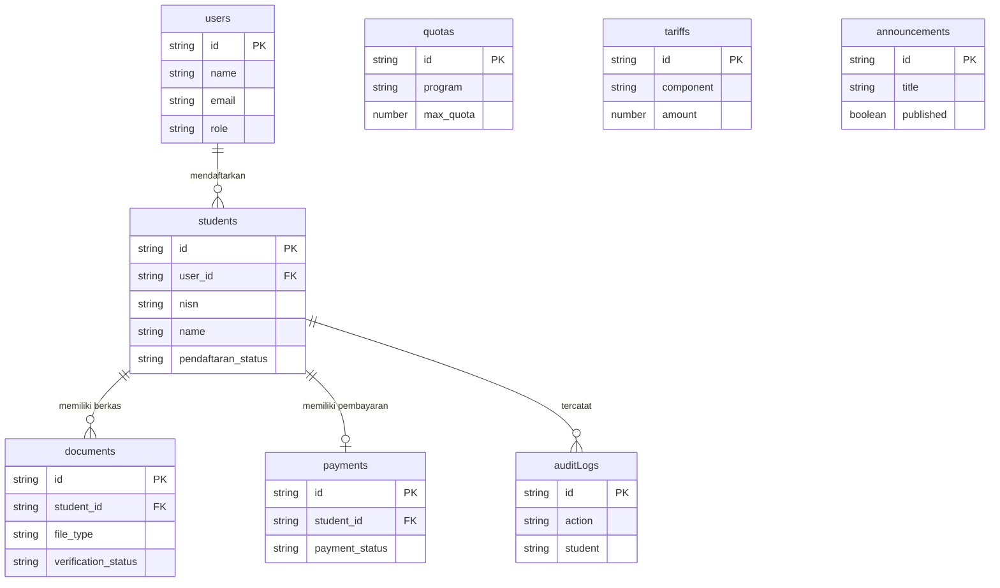
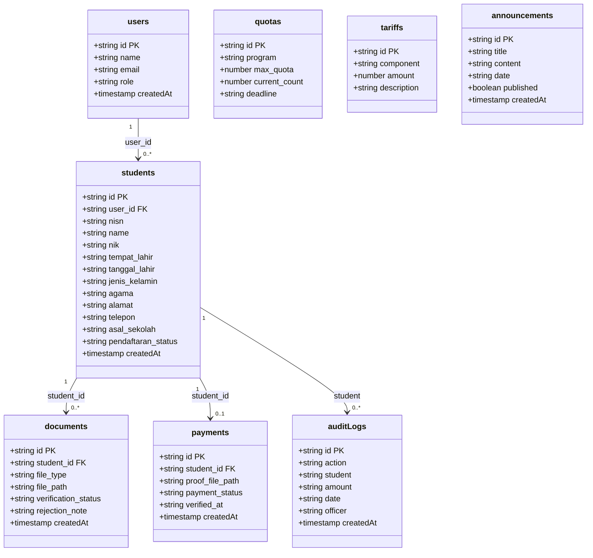

# Class Diagram — SIPDB

**Proyek:** SIPDB — Sistem Informasi Penerimaan Peserta Didik Baru

**Institusi:** SDN Karangkajen

**Mata Kuliah:** Desain dan Pengembangan Sistem Informasi

---

## B. Studi Kasus

### Judul Studi Kasus

SIPDB — Sistem Informasi Penerimaan Peserta Didik Baru SDN Karangkajen

### Deskripsi Singkat Sistem

SIPDB adalah aplikasi web berbasis Next.js yang berfungsi sebagai platform terpusat untuk mengelola seluruh alur Penerimaan Peserta Didik Baru (PPDB) di SDN Karangkajen secara digital. Sistem menggunakan Firebase Firestore sebagai database NoSQL dan Firebase Authentication untuk autentikasi pengguna. File berkas disimpan melalui Cloudinary.

Aktor yang terlibat: Pendaftar (orang tua/wali murid yang mendaftarkan siswa), Panitia (admin yang memverifikasi data dan berkas), Bendahara (memvalidasi pembayaran dan mengelola tarif), serta Kepala Sekolah (memantau statistik dan menyetujui kelulusan). Proses utama: registrasi akun → pengisian biodata → upload berkas → verifikasi berkas → pembayaran → validasi pembayaran → penentuan kelulusan → pengumuman.

---

## C. Identifikasi Class

Berdasarkan analisis kode sumber (`types.ts`, `api.ts`, `firebase.ts`) dan studi kasus PPDB di SDN Karangkajen, diidentifikasi 8 class/collection Firestore berikut:

| No | Nama Collection | Deskripsi |
|----|----------------|-----------|
| 1 | users | Menyimpan data pengguna sistem (Pendaftar, Panitia, Bendahara, Kepala Sekolah) beserta kredensial autentikasi Firebase Auth. |
| 2 | students | Menyimpan data siswa calon pendaftar beserta biodata lengkap dan status pendaftaran. |
| 3 | documents | Menyimpan data berkas persyaratan pendaftaran (KK, Akta, dll.) beserta status verifikasi. |
| 4 | payments | Menyimpan data pembayaran administrasi PPDB beserta bukti transfer dan status verifikasi. |
| 5 | quotas | Menyimpan data kuota pendaftaran per program studi (IPA, IPS, Bahasa). |
| 6 | tariffs | Menyimpan data komponen biaya dan nominal tarif PPDB. |
| 7 | announcements | Menyimpan data pengumuman resmi sekolah terkait PPDB. |
| 8 | auditLogs | Menyimpan jejak audit seluruh aktivitas verifikasi dan perubahan data penting. |

---

## D. Detail Class

### Collection: users

Dokumen pengguna yang terhubung dengan Firebase Authentication. ID dokumen sama dengan UID dari Firebase Auth.

| Field | Tipe | Keterangan |
|-------|------|------------|
| id | string | Primary key — Firebase Auth UID |
| name | string | Nama lengkap pengguna |
| email | string | Alamat email (digunakan untuk login) |
| password | string | Password (dikelola oleh Firebase Auth, tidak disimpan di Firestore) |
| role | string | Peran: `pendaftar`, `panitia`, `bendahara`, `kepsek` |
| createdAt | timestamp | Waktu pembuatan akun (server timestamp) |

**Peran Pengguna:**
- **pendaftar** — Orang tua/wali murid yang mendaftarkan siswa baru
- **panitia** — Admin yang memverifikasi data dan berkas pendaftar
- **bendahara** — Memvalidasi pembayaran, mengelola tarif, membuat laporan keuangan
- **kepsek** — Kepala sekolah yang memantau statistik dan menyetujui kelulusan

---

### Collection: students

Dokumen data siswa calon pendaftar. Setiap siswa terhubung ke satu user (orang tua) melalui `user_id`.

| Field | Tipe | Keterangan |
|-------|------|------------|
| id | string | Primary key — auto-generated Firestore ID |
| user_id | string \| null | Foreign key ke users.id (orang tua yang mendaftarkan). Null jika pendaftaran manual oleh panitia |
| nisn | string | Nomor Induk Siswa Nasional |
| name | string | Nama lengkap calon siswa |
| nik | string | Nomor Induk Kependudukan |
| tempat_lahir | string | Tempat lahir |
| tanggal_lahir | string | Tanggal lahir (format: YYYY-MM-DD) |
| jenis_kelamin | string | Jenis kelamin: `Laki-laki` atau `Perempuan` |
| agama | string | Agama siswa |
| alamat | string | Alamat lengkap |
| telepon | string | Nomor telepon/handphone |
| asal_sekolah | string | Asal sekolah dasar |
| pendaftaran_status | string | Status: `menunggu_verifikasi`, `terverifikasi`, `belum_lengkap`, `lulus` |
| createdAt | timestamp | Waktu pembuatan data |

**Status Pendaftaran:**
- `menunggu_verifikasi` — Default saat siswa terdaftar, menunggu verifikasi berkas oleh panitia
- `terverifikasi` — Semua berkas telah disetujui oleh panitia
- `belum_lengkap` — Ada berkas yang ditolak, perlu upload ulang
- `lulus` — Dinyatakan lulus oleh kepala sekolah

---

### Collection: documents

Dokumen berkas persyaratan pendaftaran. Setiap berkas terhubung ke satu siswa melalui `student_id`. Menggunakan pola upsert — jika berkas dengan `student_id` + `file_type` yang sama sudah ada, berkas diperbarui.

| Field | Tipe | Keterangan |
|-------|------|------------|
| id | string | Primary key — auto-generated Firestore ID |
| student_id | string | Foreign key ke students.id |
| file_type | string | Jenis berkas: `kk`, `akta`, `skl`, `foto`, dll. |
| file_path | string | Path/URL file di Cloudinary |
| verification_status | string | Status: `menunggu`, `disetujui`, `ditolak` |
| rejection_note | string \| null | Catatan penolakan (diisi jika status = `ditolak`) |
| createdAt | timestamp | Waktu upload |

**Status Verifikasi:**
- `menunggu` — Default saat berkas di-upload, menunggu verifikasi panitia
- `disetujui` — Berkas telah diverifikasi dan diterima
- `ditolak` — Berkas ditolak, `rejection_note` berisi alasan penolakan

**Logika Otomatis:** Jika seluruh berkas siswa berstatus `disetujui`, maka `students.pendaftaran_status` otomatis berubah menjadi `terverifikasi`. Jika ada satu berkas yang `ditolak`, status berubah menjadi `belum_lengkap`.

---

### Collection: payments

Dokumen pembayaran administrasi PPDB. Setiap siswa hanya memiliki satu catatan pembayaran (upsert).

| Field | Tipe | Keterangan |
|-------|------|------------|
| id | string | Primary key — auto-generated Firestore ID |
| student_id | string | Foreign key ke students.id |
| proof_file_path | string | Path/URL bukti pembayaran ( foto transfer) di Cloudinary |
| payment_status | string | Status: `pending`, `lunas`, `ditolak` |
| verified_at | string \| null | Timestamp verifikasi (ISO string). Null jika belum diverifikasi |
| createdAt | timestamp | Waktu pembuatan |

**Status Pembayaran:**
- `pending` — Default saat bukti pembayaran di-upload
- `lunas` — Pembayaran telah divalidasi oleh bendahara
- `ditolak` — Pembayaran ditolak oleh bendahara

---

### Collection: quotas

Dokumen kuota pendaftaran per program studi.

| Field | Tipe | Keterangan |
|-------|------|------------|
| id | string | Primary key — auto-generated Firestore ID |
| program | string | Nama program: `IPA`, `IPS`, `Bahasa` |
| max_quota | number | Kuota maksimal penerimaan |
| current_count | number | Jumlah siswa yang sudah diterima saat ini |
| deadline | string | Batas waktu pendaftaran (format: YYYY-MM-DD) |

---

### Collection: tariffs

Dokumen komponen biaya PPDB.

| Field | Tipe | Keterangan |
|-------|------|------------|
| id | string | Primary key — auto-generated Firestore ID |
| component | string | Nama komponen biaya: `SPP Bulanan`, `Biaya Pendaftaran`, `Biaya Seragam`, `Biaya Praktikum` |
| amount | number | Nominal biaya (dalam Rupiah) |
| description | string | Deskripsi komponen biaya |

---

### Collection: announcements

Dokumen pengumuman resmi sekolah.

| Field | Tipe | Keterangan |
|-------|------|------------|
| id | string | Primary key — auto-generated Firestore ID |
| title | string | Judul pengumuman |
| content | string | Isi pengumuman |
| date | string | Tanggal pengumuman (format: YYYY-MM-DD) |
| published | boolean | Status publikasi (true = ditampilkan ke publik) |
| createdAt | timestamp | Waktu pembuatan |

---

### Collection: auditLogs

Dokumen jejak audit aktivitas verifikasi. Dicatat secara otomatis setiap kali pembayaran diverifikasi atau ditolak, serta saat tarif diubah.

| Field | Tipe | Keterangan |
|-------|------|------------|
| id | string | Primary key — auto-generated Firestore ID |
| action | string | Jenis aksi: `Pembayaran Diverifikasi`, `Pembayaran Ditolak`, `Tarif Ditambahkan`, `Tarif Diubah` |
| student | string | Nama siswa terkait (atau `-` untuk aksi non-siswa) |
| amount | string | Informasi nominal (format: `Rp 250.000` atau `SPP: Rp 350.000`) |
| date | string | Waktu aksi (format: `YYYY-MM-DD HH:mm`) |
| officer | string | Nama petugas yang melakukan aksi |
| createdAt | timestamp | Waktu pembuatan (server timestamp) |

---

## E. Relasi Antar Class

### Tabel Relasi

| No | Collection 1 | Field FK | Collection 2 | Cardinality | Keterangan |
|----|-------------|----------|-------------|-------------|------------|
| 1 | users | id ← user_id | students | 1 — 0..* | Satu pengguna (pendaftar) dapat mendaftarkan banyak siswa. `user_id` null untuk pendaftaran manual panitia |
| 2 | students | id ← student_id | documents | 1 — 0..* | Satu siswa memiliki banyak berkas persyaratan (KK, Akta, dll.) |
| 3 | students | id ← student_id | payments | 1 — 0..1 | Satu siswa memiliki satu catatan pembayaran (upsert) |
| 4 | students | id (referensi) | auditLogs | 1 — 0..* | Satu siswa dapat memiliki banyak entri audit log |

### Diagram Relasi (Firestore Reference)

---

## F. Class Diagram

---

## G. Penjelasan Diagram

**Collection users** adalah collection sentral yang merepresentasikan seluruh pengguna sistem. ID dokumen menggunakan Firebase Auth UID. Field `role` menentukan hak akses: `pendaftar` (orang tua), `panitia` (admin), `bendahara`, dan `kepsek`. Password tidak disimpan di Firestore — dikelola sepenuhnya oleh Firebase Authentication.

**Collection students** menyimpan data siswa calon pendaftar beserta biodata lengkap. Field `user_id` merujuk ke `users.id` (orang tua yang mendaftarkan), namun bisa null jika pendaftaran dilakukan secara manual oleh panitia. Field `pendaftaran_status` diperbarui secara otomatis berdasarkan status verifikasi berkas.

**Collection documents** menyimpan berkas persyaratan pendaftaran. Menggunakan pola upsert berdasarkan kombinasi `student_id` + `file_type`. File disimpan di Cloudinary, Firestore hanya menyimpan path/URL-nya. Status verifikasi berubah: `menunggu` → `disetujui`/`ditolak`.

**Collection payments** menyimpan data pembayaran. Setiap siswa hanya memiliki satu catatan pembayaran (upsert). Bukti pembayaran berupa foto yang disimpan di Cloudinary. Status: `pending` → `lunas`/`ditolak`.

**Collection quotas** menyimpan kuota pendaftaran per program studi (IPA, IPS, Bahasa) beserta deadline dan jumlah siswa yang sudah diterima.

**Collection tariffs** menyimpan komponen biaya PPDB (SPP, biaya pendaftaran, seragam, praktikum).

**Collection announcements** menyimpan pengumuman resmi sekolah. Field `published` menentukan apakah pengumuman ditampilkan ke publik.

**Collection auditLogs** mencatat jejak audit secara otomatis. Dicatat setiap kali pembayaran diverifikasi/ditolak atau tarif diubah/ditambahkan.

---

## H. Mapping ke Firestore

| Class | Collection di Firestore | Keterangan |
|-------|------------------------|------------|
| users | `users` | Terhubung dengan Firebase Authentication |
| students | `students` | Biodata siswa, user_id = orang tua |
| documents | `documents` | Berkas pendaftaran, file di Cloudinary |
| payments | `payments` | Bukti pembayaran, file di Cloudinary |
| quotas | `settings/quotas` atau `quotas` | Kuota per program |
| tariffs | `settings/tariffs` atau `tariffs` | Komponen biaya |
| announcements | `announcements` | Pengumuman sekolah |
| auditLogs | `auditLogs` | Jejak audit otomatis |
