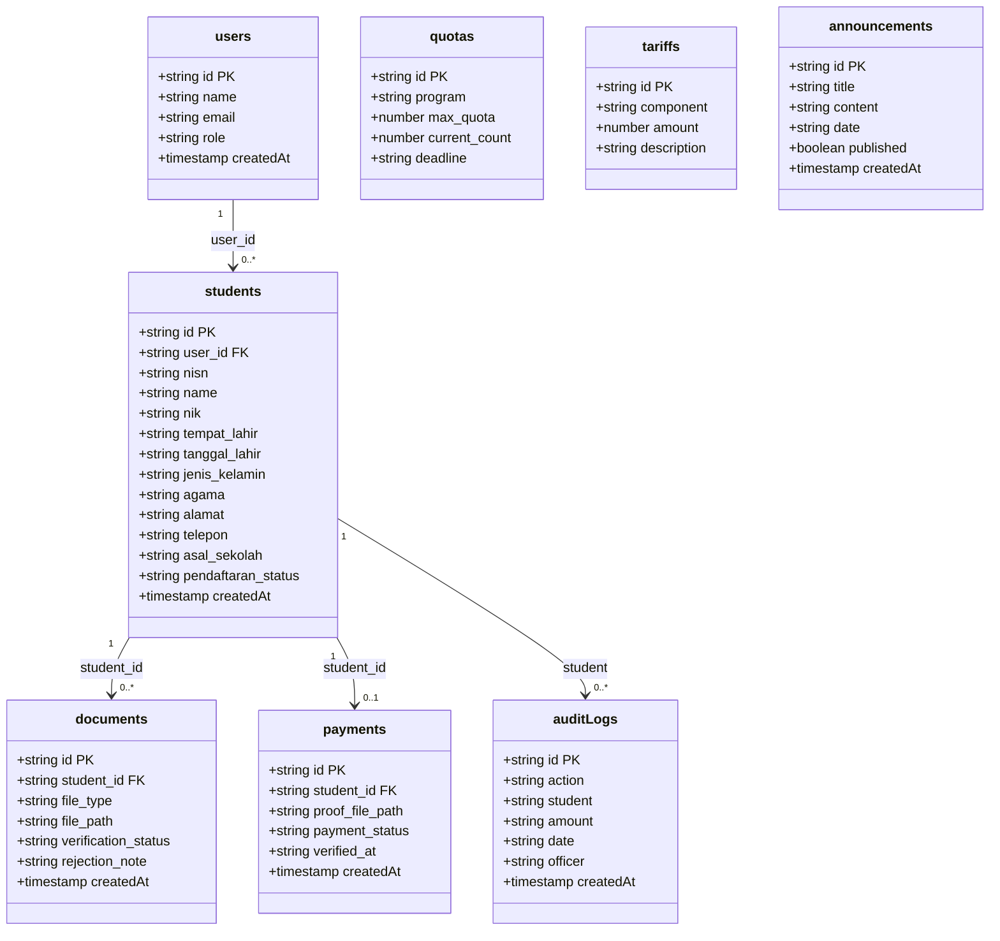

# Class Diagram — SIPDB

**Proyek:** SIPDB — Sistem Informasi Penerimaan Peserta Didik Baru

**Institusi:** SD Muhammadiyah Karangkajen

**Mata Kuliah:** Desain dan Pengembangan Sistem Informasi

---

## B. Studi Kasus

### Judul Studi Kasus

SIPDB — Sistem Informasi Penerimaan Peserta Didik Baru SD Muhammadiyah Karangkajen

### Deskripsi Singkat Sistem

SIPDB adalah aplikasi web berbasis Next.js yang berfungsi sebagai platform terpusat untuk mengelola seluruh alur Penerimaan Peserta Didik Baru (PPDB) di SD Muhammadiyah Karangkajen secara digital. Sistem menggunakan Firebase Firestore sebagai database NoSQL dan Firebase Authentication untuk autentikasi pengguna. File berkas disimpan melalui Cloudinary.

Aktor yang terlibat: Pendaftar (orang tua/wali murid yang mendaftarkan siswa), Panitia (admin yang memverifikasi data dan berkas), Bendahara (memvalidasi pembayaran dan mengelola tarif), serta Kepala Sekolah (memantau statistik). Proses utama: registrasi akun → pengisian biodata → upload berkas → verifikasi berkas → pembayaran → validasi pembayaran → penentuan kelulusan → pengumuman.

---

## C. Identifikasi Class

Berdasarkan analisis kode sumber (`types.ts`, `api.ts`, `firebase.ts`) dan studi kasus PPDB di SD Muhammadiyah Karangkajen, diidentifikasi 8 class/collection Firestore berikut:

| No | Nama Collection | Deskripsi |
|----|----------------|-----------|
| 1 | users | Menyimpan data pengguna sistem (Pendaftar, Panitia, Bendahara, Kepala Sekolah) beserta kredensial autentikasi Firebase Auth. |
| 2 | students | Menyimpan data siswa calon pendaftar beserta biodata lengkap dan status pendaftaran. |
| 3 | documents | Menyimpan data berkas persyaratan pendaftaran (KK, Akta, SKHUN, SKL) beserta status verifikasi. |
| 4 | payments | Menyimpan data pembayaran administrasi PPDB (Rp 250.000) beserta bukti transfer dan status verifikasi. |
| 5 | quotas | Menyimpan data kuota pendaftaran per program studi (Kelas Reguler, Tahfidz, Bilingual). |
| 6 | tariffs | Menyimpan data komponen biaya dan nominal tarif PPDB. |
| 7 | announcements | Menyimpan data pengumuman resmi sekolah terkait PPDB. |
| 8 | auditLogs | Menyimpan jejak audit seluruh aktivitas verifikasi dan perubahan data penting. |

---

## D. Detail Class

### Collection: users

Dokumen pengguna yang terhubung dengan Firebase Authentication. ID dokumen sama dengan UID dari Firebase Auth.

| Field | Tipe | Keterangan |
|-------|------|------------|
| id | string | Primary key — Firebase Auth UID |
| name | string | Nama lengkap pengguna |
| email | string | Alamat email (digunakan untuk login) |
| password | string | Password (dikelola oleh Firebase Auth, tidak disimpan di Firestore) |
| role | string | Peran: `pendaftar`, `panitia`, `bendahara`, `kepsek` |
| createdAt | timestamp | Waktu pembuatan akun (server timestamp) |

**Peran Pengguna:**
- **pendaftar** — Orang tua/wali murid yang mendaftarkan siswa baru
- **panitia** — Admin yang memverifikasi data dan berkas pendaftar
- **bendahara** — Memvalidasi pembayaran, mengelola tarif, membuat laporan keuangan
- **kepsek** — Kepala sekolah yang memantau statistik dan menyetujui kelulusan

---

### Collection: students

Dokumen data siswa calon pendaftar. Setiap siswa terhubung ke satu user (orang tua) melalui `user_id`.

| Field | Tipe | Keterangan |
|-------|------|------------|
| id | string | Primary key — auto-generated Firestore ID |
| user_id | string \| null | Foreign key ke users.id (orang tua yang mendaftarkan). Null jika pendaftaran manual oleh panitia |
| nisn | string | Nomor Induk Siswa Nasional (10 digit) |
| name | string | Nama lengkap calon siswa |
| nik | string | Nomor Induk Kependudukan (16 digit) |
| tempat_lahir | string | Tempat lahir |
| tanggal_lahir | string | Tanggal lahir (format: YYYY-MM-DD) |
| jenis_kelamin | string | Jenis kelamin: `Laki-laki` atau `Perempuan` |
| agama | string | Agama: Islam, Kristen, Katolik, Hindu, Buddha, Konghucu |
| alamat | string | Alamat lengkap |
| telepon | string | Nomor telepon/handphone |
| asal_sekolah | string | Asal sekolah dasar |
| pendaftaran_status | string | Status: `menunggu_verifikasi`, `terverifikasi`, `belum_lengkap`, `lulus` |
| createdAt | timestamp | Waktu pembuatan data |

**Status Pendaftaran:**
- `menunggu_verifikasi` — Default saat siswa terdaftar, menunggu verifikasi berkas oleh panitia
- `terverifikasi` — Semua berkas telah disetujui oleh panitia
- `belum_lengkap` — Ada berkas yang ditolak, perlu upload ulang
- `lulus` — Dinyatakan lulus oleh panitia

---

### Collection: documents

Dokumen berkas persyaratan pendaftaran. Setiap berkas terhubung ke satu siswa melalui `student_id`. Menggunakan pola upsert — jika berkas dengan `student_id` + `file_type` yang sama sudah ada, berkas diperbarui.

| Field | Tipe | Keterangan |
|-------|------|------------|
| id | string | Primary key — auto-generated Firestore ID |
| student_id | string | Foreign key ke students.id |
| file_type | string | Jenis berkas: `kk`, `akta`, `skhun`, `skl` |
| file_path | string | Path/URL file di Cloudinary |
| verification_status | string | Status: `menunggu`, `disetujui`, `ditolak` |
| rejection_note | string \| null | Catatan penolakan (diisi jika status = `ditolak`) |
| createdAt | timestamp | Waktu upload |

**Status Verifikasi:**
- `menunggu` — Default saat berkas di-upload, menunggu verifikasi panitia
- `disetujui` — Berkas telah diverifikasi dan diterima
- `ditolak` — Berkas ditolak, `rejection_note` berisi alasan penolakan

**Logika Otomatis:**
- Jika semua berkas siswa berstatus `disetujui` → `students.pendaftaran_status` = `terverifikasi`
- Jika ada satu berkas `ditolak` → `students.pendaftaran_status` = `belum_lengkap`

---

### Collection: payments

Dokumen pembayaran administrasi PPDB. Setiap siswa hanya memiliki satu catatan pembayaran (upsert). Biaya pendaftaran: **Rp 250.000** (transfer ke BCA 1234567890).

| Field | Tipe | Keterangan |
|-------|------|------------|
| id | string | Primary key — auto-generated Firestore ID |
| student_id | string | Foreign key ke students.id |
| proof_file_path | string | Path/URL bukti pembayaran (foto transfer) di Cloudinary |
| payment_status | string | Status: `pending`, `lunas`, `ditolak` |
| verified_at | string \| null | Timestamp verifikasi (ISO string). Null jika belum diverifikasi |
| createdAt | timestamp | Waktu pembuatan |

**Status Pembayaran:**
- `pending` — Default saat bukti di-upload, menunggu verifikasi bendahara
- `lunas` — Pembayaran telah divalidasi oleh bendahara
- `ditolak` — Pembayaran ditolak oleh bendahara

**Logika Otomatis:**
- Saat status berubah ke `lunas` atau `ditolak`, `verified_at` diisi dengan timestamp
- Audit log otomatis dicatat di `auditLogs` saat pembayaran diverifikasi/ditolak

---

### Collection: quotas

Dokumen kuota pendaftaran per program studi.

| Field | Tipe | Keterangan |
|-------|------|------------|
| id | string | Primary key — auto-generated Firestore ID |
| program | string | Nama program: `Kelas Reguler`, `Kelas Tahfidz`, `Kelas Bilingual` |
| max_quota | number | Kuota maksimal penerimaan |
| current_count | number | Jumlah siswa yang sudah diterima |
| deadline | string | Batas waktu pendaftaran (format: YYYY-MM-DD) |

**Program Defaults:**
- Kelas Reguler (A): max_quota = 120 siswa
- Kelas Tahfidz (B): max_quota = 80 siswa
- Kelas Bilingual (C): max_quota = 40 siswa

---

### Collection: tariffs

Dokumen komponen biaya PPDB.

| Field | Tipe | Keterangan |
|-------|------|------------|
| id | string | Primary key — auto-generated Firestore ID |
| component | string | Nama komponen biaya |
| amount | number | Nominal biaya (Rupiah) |
| description | string | Deskripsi komponen biaya |

---

### Collection: announcements

Dokumen pengumuman resmi sekolah.

| Field | Tipe | Keterangan |
|-------|------|------------|
| id | string | Primary key — auto-generated Firestore ID |
| title | string | Judul pengumuman |
| content | string | Isi pengumuman |
| date | string | Tanggal pengumuman (format: YYYY-MM-DD) |
| published | boolean | Status publikasi (default: true) |
| createdAt | timestamp | Waktu pembuatan |

---

### Collection: auditLogs

Dokumen jejak audit aktivitas. Dicatat otomatis saat verifikasi pembayaran atau perubahan tarif.

| Field | Tipe | Keterangan |
|-------|------|------------|
| id | string | Primary key — auto-generated Firestore ID |
| action | string | Jenis aksi |
| student | string | Nama siswa (atau `-` jika non-siswa) |
| amount | string | Informasi nominal |
| date | string | Waktu aksi (format: YYYY-MM-DD HH:mm) |
| officer | string | Nama petugas |
| createdAt | timestamp | Waktu pembuatan |

**Jenis Aksi:**
- `Pembayaran Diverifikasi` — Pembayaran siswa diterima bendahara
- `Pembayaran Ditolak` — Pembayaran siswa ditolak bendahara
- `Tarif Ditambahkan` — Komponen biaya baru ditambahkan
- `Tarif Diubah` — Nominal/komponen biaya diubah

---

## E. Relasi Antar Class

---

## F. Keterangan Relasi

| Relasi | Field Reference | Cardinality | Keterangan |
|--------|----------------|-------------|------------|
| users → students | `students.user_id` → `users.id` | 1:N | Satu pengguna (pendaftar) dapat mendaftarkan banyak siswa |
| students → documents | `documents.student_id` → `students.id` | 1:N | Satu siswa memiliki banyak berkas (KK, Akta, SKHUN, SKL) |
| students → payments | `payments.student_id` → `students.id` | 1:1 | Satu siswa memiliki satu catatan pembayaran (upsert) |
| students → auditLogs | `auditLogs.student` (referensi nama) | 1:N | Satu siswa dapat memiliki banyak entri audit |

**Catatan:** Firestore tidak memiliki foreign key constraint secara natif. Relasi dikelola oleh aplikasi melalui field reference (mirip foreign key).
