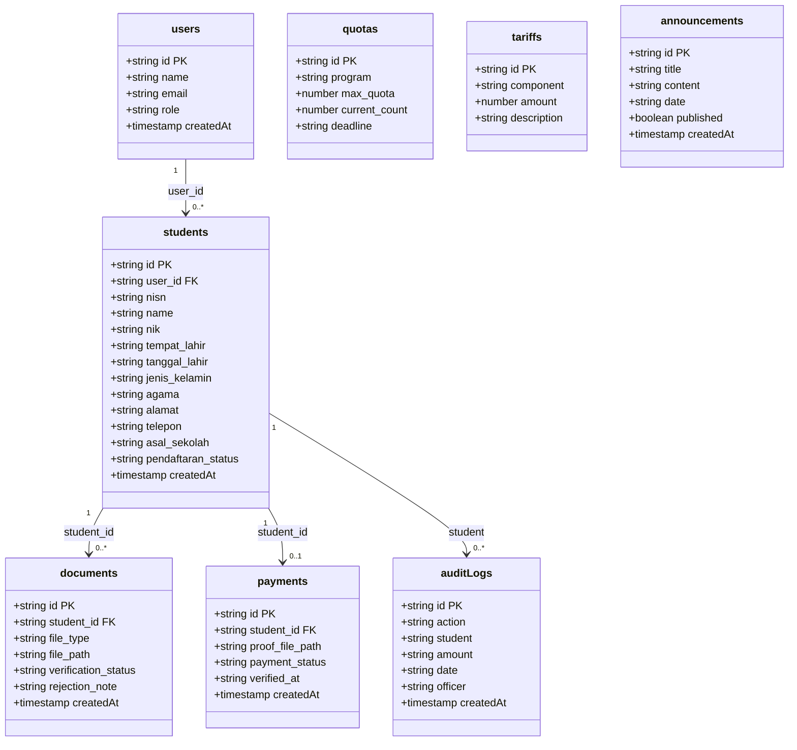

# Data Model

**Document Version:** v2.0

**Project:** SIPDB — Sistem Informasi Penerimaan Peserta Didik Baru

**Product:** Web-Based PPDB Management System (Next.js + Firebase)

**Status:** Active

**Last Updated:** 2026-07-24

**Source:** Derived from source code (`ppdb-next/src/lib/types.ts`, `api.ts`, `firebase.ts`)

---

## 1. Overview

Dokumen ini mendefinisikan model data untuk sistem SIPDB (Sistem Informasi Penerimaan Peserta Didik Baru) di SD Muhammadiyah Karangkajen. Model diturunkan langsung dari kode sumber aplikasi yang menggunakan **Firebase Firestore** sebagai database NoSQL cloud.

Sistem mengelola 8 collection Firestore yang mencakup autentikasi pengguna, biodata siswa, berkas pendaftaran, pembayaran, kuota, tarif, pengumuman, dan audit log.

**Arsitektur Data:**
- **Database:** Firebase Firestore (NoSQL, cloud-hosted)
- **Autentikasi:** Firebase Authentication (email + password)
- **File Storage:** Cloudinary (berkas, bukti pembayaran)
- **Project ID:** `dpsi-ppdb`

---

## 2. Class Diagram



---

## 3. Entity Descriptions

### 3.1 users

Collection utama autentikasi. ID dokumen menggunakan Firebase Auth UID. Password dikelola oleh Firebase Authentication dan tidak disimpan di Firestore.

| Field | Tipe | Constraint | Deskripsi |
|---|---|---|---|
| id | string | PK (Firebase Auth UID) | Pengenal unik — sama dengan UID dari Firebase Auth |
| name | string | required | Nama lengkap pengguna |
| email | string | required, unique | Alamat email (digunakan untuk login) |
| password | — | — | Dikelola oleh Firebase Auth, tidak disimpan di Firestore |
| role | string | required | Peran: `pendaftar`, `panitia`, `bendahara`, `kepsek` |
| createdAt | timestamp | server timestamp | Waktu pembuatan akun |

**Status Pendaftaran:**
- Saat register, role default adalah `pendaftar`
- Panitia, bendahara, dan kepsek dibuat secara manual oleh admin

### 3.2 students

Collection data siswa calon pendaftar. Setiap siswa terhubung ke satu user (orang tua) melalui `user_id`.

| Field | Tipe | Constraint | Deskripsi |
|---|---|---|---|
| id | string | PK (auto-generated) | Pengenal unik — Firestore document ID |
| user_id | string \| null | FK → users.id | Orang tua yang mendaftarkan. Null jika pendaftaran manual oleh panitia |
| nisn | string | required, 10 digit | Nomor Induk Siswa Nasional |
| name | string | required | Nama lengkap calon siswa |
| nik | string | required, 16 digit | Nomor Induk Kependudukan |
| tempat_lahir | string | required | Tempat lahir |
| tanggal_lahir | string | required | Tanggal lahir (YYYY-MM-DD) |
| jenis_kelamin | string | required | `Laki-laki` atau `Perempuan` |
| agama | string | required | Islam, Kristen, Katolik, Hindu, Buddha, Konghucu |
| alamat | string | required | Alamat lengkap |
| telepon | string | required | Nomor telepon/handphone |
| asal_sekolah | string | required | Asal sekolah dasar |
| pendaftaran_status | string | required, default: `menunggu_verifikasi` | Status pendaftaran |
| createdAt | timestamp | server timestamp | Waktu pembuatan |

**Status Pendaftaran (enum):**
- `menunggu_verifikasi` — Default saat siswa terdaftar
- `terverifikasi` — Semua berkas disetujui panitia
- `belum_lengkap` — Ada berkas ditolak, perlu upload ulang
- `lulus` — Dinyatakan lulus oleh panitia

### 3.3 documents

Collection berkas persyaratan pendaftaran. Menggunakan pola upsert — jika dokumen dengan `student_id` + `file_type` yang sama sudah ada, data diperbarui.

| Field | Tipe | Constraint | Deskripsi |
|---|---|---|---|
| id | string | PK (auto-generated) | Pengenal unik — Firestore document ID |
| student_id | string | FK → students.id | Siswa yang memiliki berkas |
| file_type | string | required | Jenis berkas: `kk`, `akta`, `skhun`, `skl` |
| file_path | string | required | Path/URL file di Cloudinary |
| verification_status | string | required, default: `menunggu` | Status verifikasi |
| rejection_note | string \| null | — | Catatan penolakan (diisi jika `ditolak`) |
| createdAt | timestamp | server timestamp | Waktu upload |

**Status Verifikasi (enum):**
- `menunggu` — Default saat berkas di-upload
- `disetujui` — Berkas diterima panitia
- `ditolak` — Berkas ditolak, `rejection_note` berisi alasan

**Logika Otomatis (dari `apiVerifyDocument`):**
- Jika semua berkas siswa berstatus `disetujui` → `students.pendaftaran_status` = `terverifikasi`
- Jika ada satu berkas `ditolak` → `students.pendaftaran_status` = `belum_lengkap`

### 3.4 payments

Collection pembayaran administrasi PPDB. Setiap siswa hanya memiliki satu catatan pembayaran (upsert). Biaya: **Rp 250.000** (BCA 1234567890).

| Field | Tipe | Constraint | Deskripsi |
|---|---|---|---|
| id | string | PK (auto-generated) | Pengenal unik — Firestore document ID |
| student_id | string | FK → students.id | Siswa yang melakukan pembayaran |
| proof_file_path | string | required | Path/URL bukti pembayaran (foto transfer) di Cloudinary |
| payment_status | string | required, default: `pending` | Status pembayaran |
| verified_at | string \| null | — | Timestamp verifikasi (ISO string). Null jika belum diverifikasi |
| createdAt | timestamp | server timestamp | Waktu pembuatan |

**Status Pembayaran (enum):**
- `pending` — Default saat bukti di-upload
- `lunas` — Divalidasi bendahara
- `ditolak` — Ditolak bendahara

### 3.5 quotas

Collection kuota pendaftaran per program studi.

| Field | Tipe | Constraint | Deskripsi |
|---|---|---|---|
| id | string | PK (auto-generated) | Pengenal unik — Firestore document ID |
| program | string | required | Nama program: `Kelas Reguler`, `Kelas Tahfidz`, `Kelas Bilingual` |
| max_quota | number | required | Kuota maksimal penerimaan |
| current_count | number | required | Jumlah siswa yang sudah diterima |
| deadline | string | required | Batas waktu pendaftaran (YYYY-MM-DD) |

**Program Defaults:**
- Kelas Reguler (A): 120 siswa — Kurikulum nasional dengan pendekatan modern
- Kelas Tahfidz (B): 80 siswa — Integrasi kurikulum nasional dengan tahfidz Qur'an
- Kelas Bilingual (C): 40 siswa — Pembelajaran metode bilingual Indonesia-Inggris

### 3.6 tariffs

Collection komponen biaya PPDB.

| Field | Tipe | Constraint | Deskripsi |
|---|---|---|---|
| id | string | PK (auto-generated) | Pengenal unik — Firestore document ID |
| component | string | required | Nama komponen biaya |
| amount | number | required | Nominal biaya (Rupiah) |
| description | string | required | Deskripsi komponen biaya |

### 3.7 announcements

Collection pengumuman resmi sekolah.

| Field | Tipe | Constraint | Deskripsi |
|---|---|---|---|
| id | string | PK (auto-generated) | Pengenal unik — Firestore document ID |
| title | string | required | Judul pengumuman |
| content | string | required | Isi pengumuman |
| date | string | required | Tanggal pengumuman (YYYY-MM-DD) |
| published | boolean | required, default: true | Status publikasi |
| createdAt | timestamp | server timestamp | Waktu pembuatan |

### 3.8 auditLogs

Collection jejak audit aktivitas. Dicatat otomatis saat verifikasi pembayaran atau perubahan tarif.

| Field | Tipe | Constraint | Deskripsi |
|---|---|---|---|
| id | string | PK (auto-generated) | Pengenal unik — Firestore document ID |
| action | string | required | Jenis aksi |
| student | string | required | Nama siswa (atau `-` jika non-siswa) |
| amount | string | required | Informasi nominal |
| date | string | required | Waktu aksi (YYYY-MM-DD HH:mm) |
| officer | string | required | Nama petugas |
| createdAt | timestamp | server timestamp | Waktu pembuatan |

**Jenis Aksi:**
- `Pembayaran Diverifikasi` — Pembayaran siswa diterima bendahara
- `Pembayaran Ditolak` — Pembayaran siswa ditolak bendahara
- `Tarif Ditambahkan` — Komponen biaya baru ditambahkan
- `Tarif Diubah` — Nominal/komponen biaya diubah

---

## 4. Relationships

| Relasi | Field Reference | Cardinality | Deskripsi |
|---|---|---|---|
| users → students | `students.user_id` → `users.id` | 1:N | Satu pengguna (pendaftar) dapat mendaftarkan banyak siswa |
| students → documents | `documents.student_id` → `students.id` | 1:N | Satu siswa memiliki banyak berkas (KK, Akta, SKHUN, SKL) |
| students → payments | `payments.student_id` → `students.id` | 1:1 | Satu siswa memiliki satu catatan pembayaran (upsert) |
| students → auditLogs | `auditLogs.student` (referensi nama) | 1:N | Satu siswa dapat memiliki banyak entri audit |

**Catatan:** Firestore tidak memiliki foreign key constraint secara natif. Relasi dikelola oleh aplikasi melalui field reference (mirip foreign key).

---

## 5. Business Rules

### 5.1 Aturan Pengguna
- Email harus unik di seluruh sistem (dijamin oleh Firebase Auth).
- Saat register, role default adalah `pendaftar`.
- Panitia, bendahara, dan kepsek dibuat oleh admin (bukan pendaftaran publik).
- Password dikelola oleh Firebase Authentication (min. 6 karakter).

### 5.2 Aturan Siswa
- `user_id` bisa null jika pendaftaran dilakukan secara manual oleh panitia.
- `pendaftaran_status` berubah secara otomatis berdasarkan status verifikasi berkas.
- NISN harus tepat 10 digit, NIK harus tepat 16 digit.
- Alur status: `menunggu_verifikasi` → `terverifikasi` atau `belum_lengkap` → `lulus`.

### 5.3 Aturan Berkas
- Jenis berkas: `kk`, `akta`, `skhun`, `skl` (4 jenis).
- Menggunakan pola upsert: jika `student_id` + `file_type` sudah ada, berkas diperbarui.
- File disimpan di Cloudinary, path/URL disimpan di Firestore.
- `verification_status` berubah: `menunggu` → `disetujui`/`ditolak`.
- Jika semua berkas `disetujui` → siswa otomatis `terverifikasi`.
- Jika ada berkas `ditolak` → siswa otomatis `belum_lengkap`.
- File max 2MB, format: PDF/JPG/PNG.

### 5.4 Aturan Pembayaran
- Biaya pendaftaran: Rp 250.000 (transfer ke BCA 1234567890).
- Menggunakan pola upsert: satu siswa hanya memiliki satu catatan pembayaran.
- `payment_status` berubah: `pending` → `lunas`/`ditolak`.
- Saat status `lunas` atau `ditolak`, `verified_at` diisi dengan timestamp.
- Audit log otomatis dicatat saat pembayaran diverifikasi/ditolak.

### 5.5 Aturan Kuota
- `max_quota` tidak boleh lebih rendah dari `current_count`.
- Kuota dikurangi otomatis saat siswa dinyatakan lulus.
- Program: Kelas Reguler (120), Kelas Tahfidz (80), Kelas Bilingual (40).

### 5.6 Aturan Tarif
- Perubahan tarif otomatis tercatat di `auditLogs`.

---

## 6. Firestore Indexes

| Collection | Field(s) | Tujuan |
|---|---|---|
| students | `user_id` | Query siswa berdasarkan orang tua |
| students | `pendaftaran_status` | Filtering berdasarkan status |
| documents | `student_id`, `file_type` | Upsert berkas (query komposit) |
| documents | `student_id`, `verification_status` | Cek status verifikasi semua berkas |
| payments | `student_id` | Upsert pembayaran |
| announcements | `date` (descending) | Pengumuman terbaru di atas |
| auditLogs | `date` (descending) | Audit log terbaru di atas |

---

## 7. Firebase Security Rules (Konseptual)

```javascript
rules_version = '2';
service cloud.firestore {
  match /databases/{database}/documents {
    match /users/{userId} {
      allow read: if request.auth != null && request.auth.uid == userId;
      allow write: if false;
    }

    match /students/{studentId} {
      allow read: if request.auth != null;
      allow create: if request.auth != null;
      allow update: if request.auth != null;
    }

    match /documents/{docId} {
      allow read: if request.auth != null;
      allow write: if request.auth != null;
    }

    match /payments/{paymentId} {
      allow read: if request.auth != null;
      allow write: if request.auth != null;
    }

    match /quotas/{quotaId} {
      allow read: if true;
      allow write: if request.auth != null;
    }

    match /tariffs/{tariffId} {
      allow read: if true;
      allow write: if request.auth != null;
    }

    match /announcements/{annId} {
      allow read: if true;
      allow write: if request.auth != null;
    }

    match /auditLogs/{logId} {
      allow read: if request.auth != null;
      allow write: if false;
    }
  }
}
```

---

## 8. Traceability

| Collection | Referensi Kebutuhan | Fitur |
|---|---|---|
| users | F-01, F-02, NF-01, NF-02, NF-03 | Registrasi akun, login, autentikasi Firebase Auth |
| students | F-03, F-06, F-07 | Formulir biodata (NISN 10 digit, NIK 16 digit), status pendaftaran |
| documents | F-04, F-08 | Upload berkas (kk, akta, skhun, skl), verifikasi berkas oleh panitia |
| payments | F-05, F-13, F-15, F-16 | Upload bukti (Rp 250.000), validasi pembayaran oleh bendahara |
| quotas | F-09, F-17 | Kuota program (Reguler/Tahfidz/Bilingual), monitoring statistik |
| tariffs | F-14, F-15 | Komponen biaya, laporan keuangan |
| announcements | F-11, F-18 | Pengumuman resmi, informasi PPDB |
| auditLogs | NF-03 | Jejak audit verifikasi pembayaran dan perubahan tarif |
