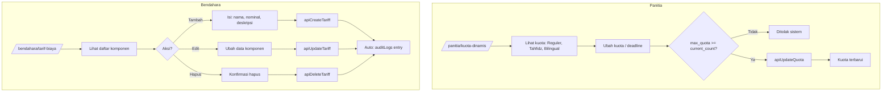

# User Flow: UC-003 — Pengaturan Kuota Dinamis & Tarif

**Use Case ID:** UC-003

**Project:** SIPDB — Sistem Informasi Penerimaan Peserta Didik Baru

---

## Actor

- **Panitia** (untuk Kuota)
- **Bendahara** (untuk Tarif)

## Precondition

- Telah login sebagai `panitia` (kuota) atau `bendahara` (tarif)

---

## Flow: Kuota Dinamis (Panitia)

1. Akses `/panitia/kuota-dinamis`
2. Sistem menampilkan daftar program beserta kuota saat ini:
   - Kelas Reguler (A): default 120
   - Kelas Tahfidz (B): default 80
   - Kelas Bilingual (C): default 40
3. Panitia melihat: program, max_quota, current_count, deadline
4. Panitia mengubah kuota atau deadline
5. Klik "Simpan" → `apiUpdateQuota(id, { max_quota, deadline })`
6. Kuota diperbarui secara real-time

## Flow: Tarif Biaya (Bendahara)

### Tambah Komponen
1. Akses `/bendahara/tarif-biaya`
2. Sistem menampilkan daftar komponen biaya
3. Klik "Tambah Komponen"
4. Isi: nama komponen, nominal (Rp), deskripsi
5. Klik "Simpan" → `apiCreateTariff({ component, amount, description })`
6. Refresh daftar

### Edit Komponen
1. Klik komponen yang ingin diubah
2. Ubah data
3. Klik "Simpan" → `apiUpdateTariff(id, data)`

### Hapus Komponen
1. Klik "Hapus" pada komponen
2. Konfirmasi hapus
3. `apiDeleteTariff(id)`

### Audit Log
- Setiap perubahan tarif (tambah/edit/hapus) otomatis tercatat di `auditLogs`

## Postcondition

- Kuota program diperbarui
- Komponen biaya terkelola
- Perubahan tercatat di audit log

## Business Rules

- Kuota dapat diubah di tengah jalan saat pendaftaran aktif
- `max_quota` tidak boleh lebih rendah dari `current_count`
- Perubahan tarif otomatis tercatat di audit log

---

## Diagram

