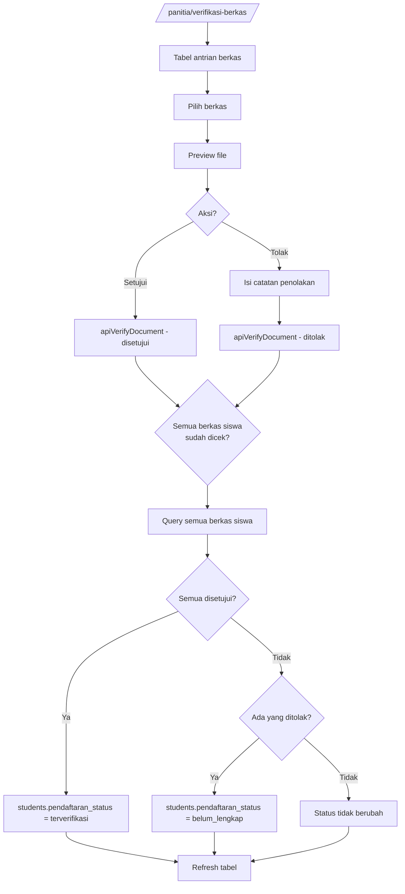

# User Flow: UC-004 — Verifikasi Berkas & Notifikasi Revisi

**Use Case ID:** UC-004

**Project:** SIPDB — Sistem Informasi Penerimaan Peserta Didik Baru

---

## Actor

- **Panitia** (Admin Sekolah)

## Precondition

- Telah login sebagai `panitia`
- Ada berkas dari pendaftar yang perlu diverifikasi

---

## Flow

1. Akses `/panitia/verifikasi-berkas`
2. Sistem menampilkan tabel antrian berkas:
   - Kolom: Nama Siswa, Jenis Berkas (KK/Akta/SKHUN/SKL), Status, Tanggal Upload
3. Panitia memilih berkas yang akan diverifikasi
4. Sistem menampilkan detail berkas (preview file)
5. Panitia memilih aksi:

### Flow: Setujui
6a. Klik "Setujui"
7a. `apiVerifyDocument(docId, 'disetujui')`
8a. Status berkas → `disetujui`

### Flow: Tolak
6b. Klik "Tolak"
7b. Isi catatan penolakan (wajib)
8b. `apiVerifyDocument(docId, 'ditolak', note)`
9b. Status berkas → `ditolak`, `rejection_note` terisi

### Auto-Update Status Siswa
9. Sistem otomatis query semua berkas siswa:
   - Jika semua berkas `disetujui` → `students.pendaftaran_status` = `terverifikasi`
   - Jika ada berkas `ditolak` → `students.pendaftaran_status` = `belum_lengkap`
10. Refresh tabel

## Postcondition

- Status berkas diperbarui
- Status siswa diperbarui otomatis berdasarkan kombinasi semua berkas

## Business Rules

- Catatan wajib diisi saat menolak
- Status siswa berubah otomatis (tidak perlu aksi manual)
- Jika semua berkas `disetujui` → siswa otomatis `terverifikasi`
- Jika ada berkas `ditolak` → siswa otomatis `belum_lengkap`

---

## Diagram

