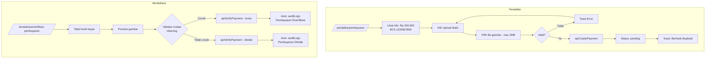

# User Flow: UC-005 — Upload Bukti & Verifikasi Pembayaran

**Use Case ID:** UC-005

**Project:** SIPDB — Sistem Informasi Penerimaan Peserta Didik Baru

---

## Actor

- **Pendaftar** (untuk Upload)
- **Bendahara** (untuk Verifikasi)

## Precondition

- Telah login sebagai `pendaftar` (upload) atau `bendahara` (verifikasi)

---

## Flow: Upload Bukti Pembayaran (Pendaftar)

1. Akses `/pendaftar/pembayaran`
2. Sistem menampilkan:
   - Info biaya: "Biaya pendaftaran: Rp 250.000"
   - Info transfer: "Transfer ke: BCA 1234567890 a.n SD Muhammadiyah Karangkajen"
   - Status saat ini (jika sudah ada)
3. Klik "Upload Bukti Pembayaran"
4. Sistem membuka file picker (accept: .jpg, .jpeg, .png)
5. Pengguna memilih foto bukti transfer (maks. 2MB)
6. Sistem memvalidasi:
   - File harus gambar (image/*)
   - Ukuran max 2MB
7. Jika valid → `apiCreatePayment(studentId, fileName)`
8. Status default: `pending`
9. Refresh status
10. Toast: "Bukti pembayaran berhasil diupload"

## Flow: Upload Ulang (Upsert)

1. Jika sudah upload tapi ingin mengganti bukti
2. Klik "Upload Bukti Pembayaran" lagi
3. Pilih file baru
4. `apiCreatePayment` → update `proof_file_path`, reset `payment_status: 'pending'`, `verified_at: null`

## Flow: Verifikasi Pembayaran (Bendahara)

1. Akses `/bendahara/verifikasi-pembayaran`
2. Sistem menampilkan tabel bukti bayar:
   - Kolom: Nama Siswa, Foto Bukti, Status, Tanggal Upload
3. Bendahara memilih bukti bayar
4. Sistem menampilkan preview gambar
5. Bendahara memvalidasi berdasarkan mutasi rekening sekolah
6. Memilih aksi:

### Flow: Lunas
6a. Klik "Lunas"
7a. `apiVerifyPayment(paymentId, 'lunas', officerName)`
8a. `payment_status` → `lunas`, `verified_at` → timestamp
9a. Auto-create `auditLogs`: { action: 'Pembayaran Diverifikasi', student, date, officer }

### Flow: Tolak
6b. Klik "Tolak"
7b. `apiVerifyPayment(paymentId, 'ditolak', officerName)`
8b. `payment_status` → `ditolak`, `verified_at` → timestamp
9b. Auto-create `auditLogs`: { action: 'Pembayaran Ditolak', student, date, officer }

## Postcondition

- Bukti pembayaran tersimpan
- Status pembayaran diperbarui oleh bendahara
- Audit log otomatis tercatat

## Business Rules

- Orang tua cukup upload foto struk — tanpa form teks tambahan
- Bendahara memvalidasi berdasarkan mutasi rekening sekolah
- Pola upsert: satu siswa hanya memiliki satu catatan pembayaran
- Format file: JPG, PNG
- File max 2MB
- Biaya pendaftaran: Rp 250.000

---

## Diagram

