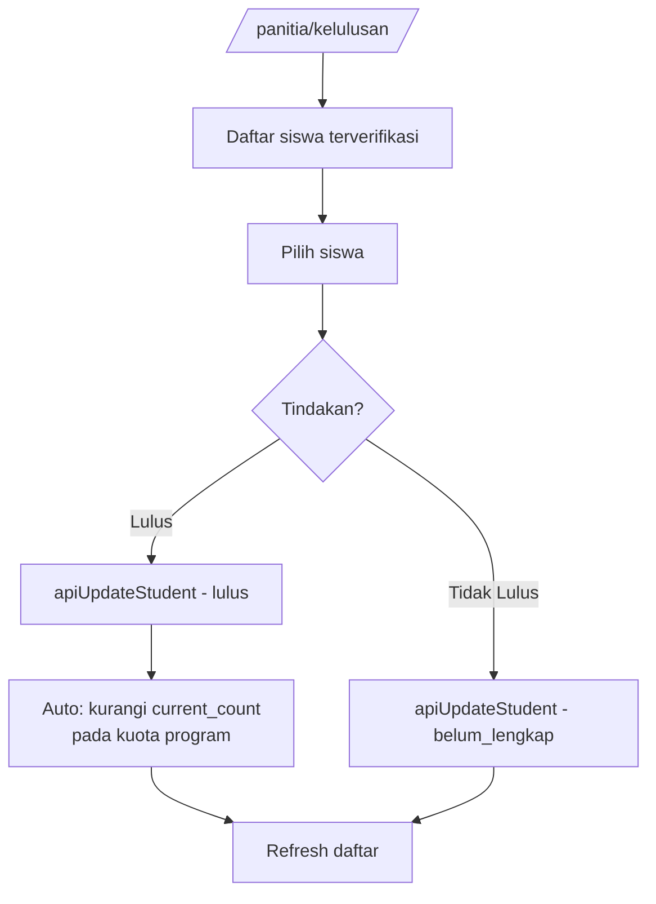

# User Flow: UC-006 — Penentuan & Penerbitan Kelulusan

**Use Case ID:** UC-006

**Project:** SIPDB — Sistem Informasi Penerimaan Peserta Didik Baru

---

## Actor

- **Panitia** (Admin Sekolah)

## Precondition

- Telah login sebagai `panitia`
- Ada siswa dengan status `terverifikasi` (semua berkas disetujui)

---

## Flow

1. Akses `/panitia/kelulusan`
2. Sistem menampilkan daftar siswa terverifikasi:
   - Kolom: Nama Siswa, Asal Sekolah, Program, Status, Tanggal Verifikasi
3. Panitia meninjau data siswa
4. Untuk setiap siswa, memilih aksi:

### Flow: Lulus
5a. Klik "Lulus" pada siswa
6a. `apiUpdateStudent(studentId, { pendaftaran_status: 'lulus' })`
7a. Status siswa → `lulus`

### Flow: Tidak Lulus
5b. Klik "Tidak Lulus" pada siswa
6b. `apiUpdateStudent(studentId, { pendaftaran_status: 'belum_lengkap' })`
7b. Status siswa → `belum_lengkap`

### Update Kuota (Otomatis)
8. Sistem mengurangi `current_count` pada kuota program yang sesuai
9. Refresh daftar

## Postcondition

- Status kelulusan ditentukan
- Kuota program dikurangi otomatis

## Business Rules

- Hanya panitia yang dapat menentukan kelulusan
- Hanya siswa dengan status `terverifikasi` yang dapat dinyatakan lulus
- Kuota program dikurangi otomatis saat siswa dinyatakan lulus

---

## Diagram

