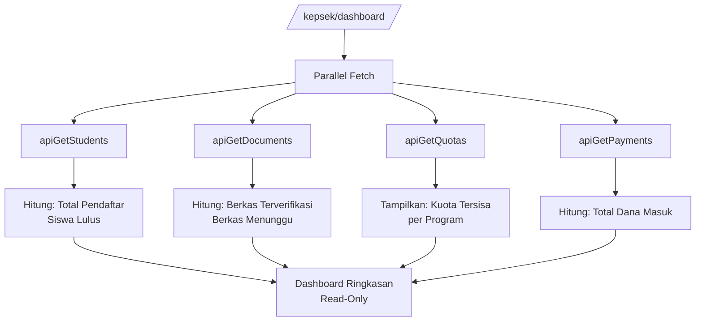

# User Flow: UC-007 — Pemantauan Dashboard Eksekutif

**Use Case ID:** UC-007

**Project:** SIPDB — Sistem Informasi Penerimaan Peserta Didik Baru

---

## Actor

- **Kepala Sekolah** (Eksekutif)

## Precondition

- Telah login sebagai `kepsek`

---

## Flow

1. Akses `/kepsek/dashboard`
2. Sistem secara paralel mengambil data dari Firestore:
   - `apiGetStudents()` → hitung berdasarkan `pendaftaran_status`
   - `apiGetDocuments()` → hitung berdasarkan `verification_status`
   - `apiGetQuotas()` → tampilkan sisa kuota per program
   - `apiGetPayments()` → total berdasarkan `payment_status`
3. Sistem menampilkan satu halaman ringkasan:
   - **Total Pendaftar:** jumlah seluruh siswa
   - **Berkas Terverifikasi:** jumlah berkas yang sudah disetujui
   - **Siswa Lulus:** jumlah siswa dinyatakan lulus
   - **Kuota Tersisa:** per program (Reguler, Tahfidz, Bilingual)
   - **Total Dana Masuk:** jumlah pembayaran lunas × Rp 250.000
4. Semua data bersifat **read-only** — tidak ada tombol aksi

## Postcondition

- Kepsek memiliki visibilitas real-time terhadap seluruh proses PPDB
- Data ditampilkan dalam format agregasi (tidak per detail siswa)

## Business Rules

- Dashboard bersifat read-only — tidak ada aksi edit atau delete
- Menyajikan agregasi data akun, berkas, kuota, dan nominal dana masuk
- Data diambil langsung dari Firestore (real-time)

---

## Diagram

